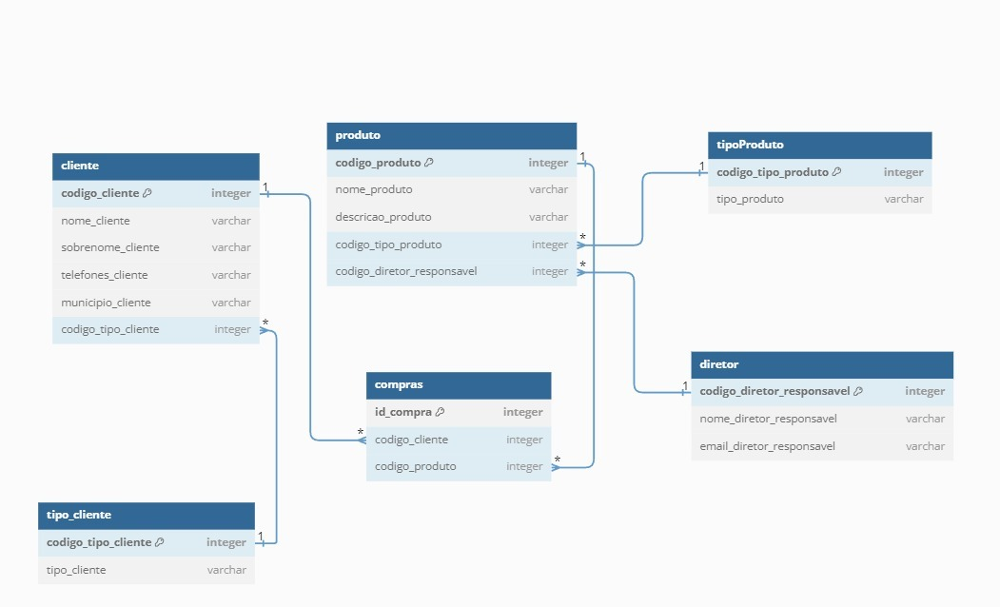

# Avaliação Bancos de Dados I

## Integrantes do Grupo
- Gabriel Alencar - [GitHub](https://github.com/devalenca)
- Lucas Lima - [GitHub](https://github.com/usuario2)
- Gabriel Makou - [GitHub](https://github.com/GMakhoul)

## Modelagem e normalização de bancos de dados relacionais
Certo dia, um dos gestores do banco em que você trabalha como cientista de dados procurou você pedindo ajuda para projetar um pequeno banco de dados com o objetivo de mapear os clientes da companhia pelos diferentes produtos financeiros que eles contrataram.

O gestor explicou que o banco tinha uma grande quantidade de clientes e oferecia uma variedade de produtos financeiros, como cartões de crédito, empréstimos, seguros e investimentos. No entanto, eles estavam tendo dificuldades para entender quais produtos eram mais populares entre os clientes e como esses produtos estavam interagindo entre si.

Como ponto de partida, o gestor deixou claro que um cliente pode contratar vários produtos diferentes ao passo que um mesmo produto pode também estar associado a vários clientes diferentes e elaborou um rústico esboço de banco de dados com duas tabelas, da seguinte forma:

Tabela 1

- Nome da tabela: cliente
- Colunas: codigo_cliente, nome_cliente, sobrenome_cliente, telefones_cliente, municipio_cliente, codigo_tipo_cliente, tipo_cliente

Tabela 2

- Nome da tabela: produto
- Colunas: codigo_produto, nome_produto, descricao_produto, codigo_tipo_produto, tipo_produto, codigo_diretor_responsavel, nome_diretor_responsavel, email_diretor_responsavel

## 1) Ainda sem fazer normalizações, apresente o modelo conceitual deste esboço oferecido pelo gestor, destacando atributos chaves e multivalorados, caso existam, e apresentando também a cardinalidade dos relacionamentos.


- As duas tabelas sugeridas pelo cliente não possuem uma chave unica de relação entre elas, podendo assim causar problemas de relacionamento de base.

- Modelo conceitual da base normalizada:



## 2) Agora apresente um modelo lógico que expresse as mesmas informações e relacionamentos descritos no modelo original, mas decompondo-os quando necessário para que sejam respeitadas as 3 primeiras formas normais. Destaque atributos chaves e multivalorados, caso existam, e apresente também a cardinalidade dos relacionamentos.

```sql
-- Tabela tipo_cliente
CREATE TABLE tipo_cliente (
    codigo_tipo_cliente SERIAL PRIMARY KEY, 
    tipo_cliente VARCHAR(255) NOT NULL
);

-- Tabela cliente
CREATE TABLE cliente (
    codigo_cliente SERIAL PRIMARY KEY,
    nome_cliente VARCHAR(255) NOT NULL,
    sobrenome_cliente VARCHAR(255),
    telefones_cliente BIGINT, -- Atributo multivalorado
    municipio_cliente VARCHAR(255),
    codigo_tipo_cliente INT,
    CONSTRAINT fk_tipo_cliente FOREIGN KEY (codigo_tipo_cliente)
        REFERENCES tipo_cliente(codigo_tipo_cliente)
);

-- Tabela tipoProduto
CREATE TABLE tipoProduto (
    codigo_tipo_produto SERIAL PRIMARY KEY,
    tipo_produto VARCHAR(255) NOT NULL
);

-- Tabela diretor
CREATE TABLE diretor (
    codigo_diretor_responsavel SERIAL PRIMARY KEY,
    nome_diretor_responsavel VARCHAR(255) NOT NULL,
    email_diretor_responsavel VARCHAR(255)
);

-- Tabela produto
CREATE TABLE produto (
    codigo_produto SERIAL PRIMARY KEY,
    nome_produto VARCHAR(255) NOT NULL,
    descricao_produto TEXT,
    codigo_tipo_produto INT,
    codigo_diretor_responsavel INT,
    CONSTRAINT fk_tipo_produto FOREIGN KEY (codigo_tipo_produto)
        REFERENCES tipoProduto(codigo_tipo_produto),
    CONSTRAINT fk_diretor FOREIGN KEY (codigo_diretor_responsavel)
        REFERENCES diretor(codigo_diretor_responsavel)
);

-- Tabela compras
CREATE TABLE compras (
    id_compra SERIAL PRIMARY KEY,
    codigo_cliente INT,
    codigo_produto INT,
    CONSTRAINT fk_cliente FOREIGN KEY (codigo_cliente)
        REFERENCES cliente(codigo_cliente),
    CONSTRAINT fk_produto FOREIGN KEY (codigo_produto)
        REFERENCES produto(codigo_produto)
);
```
- Cardinalidade são as "CONSTRAINT".
- PRIMARY KEY são as chaves primarias.
- O unico valor multi valorado é a o telefone dos clientes.

- Criamos uma tabela de compras, que é uma tabela de relacionamento, pois assim teriamos uma tabela "mestra" para conseguir unir todas as outras tabelas atravez de uma chave unica para cada, assim criando um modelo estrela de relação das bases.

# Consultas SQL simples e complexas em um banco de dados postgres
Um exemplo de modelo de banco de dados com relacionamento muitos-para-muitos pode ser o de um e-commerce que tem produtos e categorias, onde um produto pode pertencer a várias categorias e uma categoria pode estar associada a vários produtos. Nesse caso, teríamos duas tabelas: "produtos" e "categorias", com uma tabela intermediária "produtos_categorias" para relacionar os produtos às suas categorias.
```sql
CREATE TABLE produtos (
    id SERIAL PRIMARY KEY,
    nome VARCHAR(100) NOT NULL,
    preco DECIMAL(10, 2) NOT NULL,
);

CREATE TABLE categorias (
    id SERIAL PRIMARY KEY,
    nome VARCHAR(100) NOT NULL
);

CREATE TABLE produtos_categorias (
    produto_id INTEGER REFERENCES produtos(id),
    categoria_id INTEGER REFERENCES categorias(id),
    PRIMARY KEY (produto_id, categoria_id)
);
```
- Criação das tabelas uma a uma, colocando incrmento automatico onde era necessario. 

## 3. Listar produtos com preço acima de 100 reais

A consulta lista os nomes de todos os produtos que custam mais de 100 reais, ordenando-os primeiramente pelo preço e em segundo lugar pelo nome. Os alias utilizados renomeiam as colunas para "Nome do Produto" e "Preço".

```sql
SELECT
    nome AS Nome_do_Produto,
    preco AS Preço
FROM
    produtos
WHERE
    preco > 100
ORDER BY
    preco ASC, 
    nome ASC;
```

- Querry simples de SQL onde selecionamos as colunas da tabela que queremos, filtramos com "WHERE" o valor e ordenamos pelas colunas desejasdas.

## 4. Produtos com preço maior que a média

Essa consulta lista todos os IDs e preços dos produtos cujo preço é maior do que a média de todos os preços encontrados na tabela "produtos".

```sql
SELECT
    id,
    preco
FROM
    produtos
WHERE
    preco > (
        SELECT
            AVG(preco)
        FROM
            produtos
    );
```
- Como na primeira foram selecionada as colunas pertinentes, e usamos a função agregadora "AVG" dentro de um sub-querry para filtrar os dados.

## 5. Preço médio dos produtos por categoria

A consulta a seguir exibe, para cada categoria, o preço médio do conjunto de produtos a ela associados. Caso uma categoria não tenha nenhum produto associado, ela não aparecerá no resultado final. A consulta está ordenada pelos nomes das categorias.

```sql
SELECT
    c.nome AS Categoria, 
    AVG(p.preco) AS Preco_Medio
FROM
    categorias c
INNER JOIN
    produtos_categorias pc ON c.id = pc.categoria_id
INNER JOIN
    produtos p ON pc.produto_id = p.id
GROUP BY
    c.nome
ORDER BY
    c.nome;
```

- Aqui selecionamos novamente as colunas pertintentes, mas destavez usamos uma função agregadora AVG para pegar a média dos preços. Além disso precisamos fazer dois joins para obter todas as informações necessarias.

## Inserções, alterações e remoções de objetos e dados em um banco de dados postgres

Você está participando de um processo seletivo para trabalhar como cientista de dados na Ada, uma das maiores formadoras do país em áreas correlatadas à tecnologia. Dividido em algumas etapas, o processo tem o objetivo de avaliar você nos quesitos Python, Machine Learning e Bancos de Dados. Ainda que os dois primeiros sejam o cerne da sua atuação no dia-a-dia, considera-se que Bancos de Dados também constituem um requisito importante e, por isso, esta etapa pode ser a oportunidade que você precisava para se destacar dentre os seus concorrentes, demonstrando um conhecimento mais amplo do que os demais.

## 6) Com o objetivo de demonstrar o seu conhecimento através de um exemplo contextualizado com o dia-a-dia da escola, utilize os comandos do subgrupo de funções DDL para construir o banco de dados simples abaixo, que representa um relacionamento do tipo 1,n entre as entidades "aluno" e "turma":

Tabela 1

- Nome da tabela: aluno
- Colunas da tabela: id_aluno (INT), nome_aluno (VARCHAR), aluno_alocado (BOOLEAN), id_turma (INT)

Tabela 2

- Nome da tabela: turma
- Colunas da tabela: id_turma (INT), código_turma (VARCHAR), nome_turma (VARCHAR)

```sql
create table turma(
  id_turma SERIAL primary key,
  codigo_turma varchar(150),
  nome_turma varchar(250)
)


create table aluno(
  id_aluno SERIAL primary key ,
  nome_aluno varchar (250),
  aluno_alocado BOOLEAN,
  id_turma int references turma(id_turma)
  
)
```
- Criação simples de duas tabelas como pedido no enunciado, colocamos incremento automatico nas colunas de ID.

## 7) Agora que você demonstrou que consegue ser mais do que um simples usuário do banco de dados, mostre separadamente cada um dos códigos DML necessários para cumprir cada uma das etapas a seguir:
- a) Inserir pelo menos duas turmas diferentes na tabela de turma;
```sql
insert into turma(codigo_turma, nome_turma) 
VALUES
('T001', 'Turma de Python'),
('T002', 'Turma de Machine Learning'),
('T003', 'Turma de Data Science'),
('T004', 'Turma de Inteligência Artificial'),
('T005', 'Turma de Banco de Dados'),
('T006', 'Turma de Desenvolvimento Web'),
('T007', 'Turma de DevOps'),
('T008', 'Turma de Engenharia de Dados'),
('T009', 'Turma de Análise de Dados'),
('T010', 'Turma de Cloud Computing');
```
- Populamos a tabela de turmas.

- b) Inserir pelo menos 1 aluno alocado em cada uma destas turmas na tabela aluno (todos com NULL na coluna aluno_alocado)

```sql
INSERT INTO aluno (nome_aluno, aluno_alocado, id_turma) VALUES
    ('João Silva', NULL, 1),
    ('Maria Souza', NULL, 2),
    ('Pedro Santos', NULL, 1),
    ('Beatriz Costa', NULL, 2),
    ('Fernanda Lima', NULL, 3),
    ('Gustavo Ferreira', NULL, 1),
    ('Larissa Mendes', NULL, 2),
    ('Ricardo Nunes', NULL, 3),
    ('Thiago Barbosa', NULL, 1),
    ('Vanessa Oliveira', NULL, 2);
```
- Populamos a tabela de alunos.

- c) Inserir pelo menos 2 alunos não alocados em nenhuma turma na tabela aluno (todos com NULL na coluna aluno_alocado)

```sql
INSERT INTO aluno (nome_aluno, aluno_alocado, id_turma) VALUES
    ('Carlos Pereira', NULL, NULL),
    ('Ana Oliveira', NULL, NULL),
    ('Lucas Alves', NULL, NULL),
    ('Juliana Amaral', NULL, NULL),
    ('Mariana Silva', NULL, NULL);
```
- Adicionamos mais alunos os quais não estavam alocados em nenhuma turma.

- d) Atualizar a coluna aluno_alocado da tabela aluno, de modo que os alunos associados a uma disciplina recebam o
valor True e alunos não associdos a nenhuma disciplina recebam o falor False para esta coluna.

```sql
UPDATE aluno
SET aluno_alocado = CASE
    WHEN id_turma IS NOT NULL THEN TRUE
    ELSE FALSE
END;
```
- Buscando os resultados da tabela aluno no campo aluno_alocado, quando o id_turma do aluno não for nullo, ele altarará o campo para TRUE e caso contrário, alterará para FALSE. 